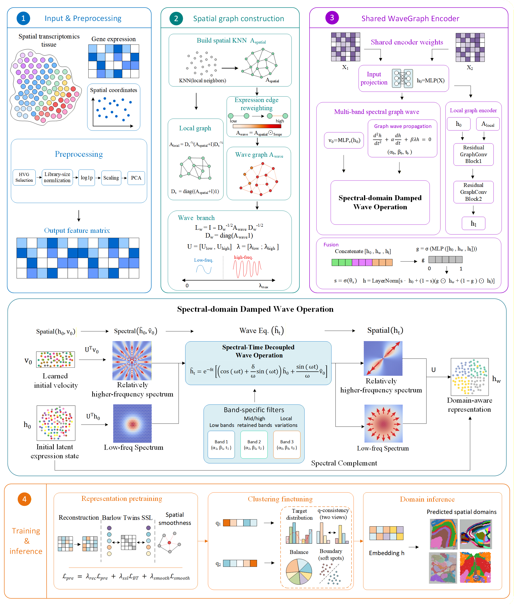

# STWaveGraph: Spatial Domain Identification in Spatial Transcriptomics via Multi-Band Damped Graph Wave Propagation

## Overview

Spatial transcriptomics (ST) enables transcriptome-wide molecular profiling while preserving the spatial organization of tissue sections. Accurately identifying spatial domains is a fundamental task for understanding tissue architecture, cellular neighborhoods, and disease-associated microenvironments. However, existing graph-based methods often rely on repeated neighborhood aggregation, which may behave like diffusion-like smoothing and blur sharp molecular transitions at anatomical or pathological boundaries.

**STWaveGraph** is a frequency-adaptive graph spectral learning framework designed for robust and boundary-aware spatial domain identification in spatial transcriptomics. It features:

- **Expression-Reweighted Wave Graph:** Constructs spatial graphs from physical coordinates and reweights spatial edges using transcriptomic similarity, reducing potential cross-boundary signal mixing between transcriptionally dissimilar neighboring spots or cells.
- **Multi-Band Damped Graph Wave Propagation:** Introduces a graph spectral propagation module based on damped wave dynamics. Unlike conventional diffusion-like graph aggregation, STWaveGraph allows retained spectral components to follow learnable band-specific propagation behaviors, capturing both smooth tissue-level organization and localized spatial transitions.
- **Residual Local Graph Encoder:** Preserves short-range spatial continuity and neighborhood-level coherence through a residual graph convolutional branch, complementing the spectral wave branch.
- **Adaptive Spectral-Local Fusion:** Combines the spectral wave representation, local graph representation, and initial latent features through a learnable fusion mechanism to balance global graph spectral structure and local spatial consistency.
- **Boundary-Aware Clustering Refinement:** Optimizes spatial domain embeddings through representation pretraining and clustering-oriented fine-tuning, including reconstruction, cross-view consistency, spatial coherence, clustering alignment, cluster balance, and boundary-aware regularization.



## Installation

We recommend using [Conda](https://docs.conda.io/en/latest/) to manage your environment. STWaveGraph is implemented in Python and relies on PyTorch, Scanpy, Anndata, Rpy2, and common scientific computing packages.

```python
# 1. Clone the repository
git clone https://github.com/JiruiZhang/STWaveGraph.git
cd STWaveGraph

# 2. Create a conda environment
conda create -n stwavegraph_env python=3.8
conda activate stwavegraph_env

# 3. Install PyTorch
# Please install the PyTorch version according to your CUDA/cuDNN environment.
# The following command is an example for CUDA 10.2.
conda install pytorch torchvision torchaudio cudatoolkit=10.2 -c pytorch

# Or install PyTorch by pip
pip install torch>=1.8.0

# 4. Install required Python packages
pip install numpy==1.22.3
pip install scanpy==1.9.1
pip install anndata==0.8.0
pip install rpy2==3.4.1
pip install pandas==1.4.2
pip install scipy==1.8.1
pip install scikit-learn==1.1.1
pip install tqdm==4.64.0
pip install matplotlib==3.4.2
```

# Requirements

- python == 3.8
- torch >= 1.8.0
- cudnn >= 10.2
- numpy == 1.22.3
- scanpy == 1.9.1
- anndata == 0.8.0
- rpy2 == 3.4.1
- pandas == 1.4.2
- scipy == 1.8.1
- scikit-learn == 1.1.1
- tqdm == 4.64.0
- matplotlib == 3.4.2
- R == 4.0.3

## Tutorial

A Jupyter Notebook of the tutorial is accessible from :

[https://github.com/JiruiZhang/STWaveGraph-main/blob/main/STWaveGraph/DLPFC.ipynb](https://github.com/JiruiZhang/STWaveGraph/blob/main/STWaveGraph-main/10X Visium.ipynb)
